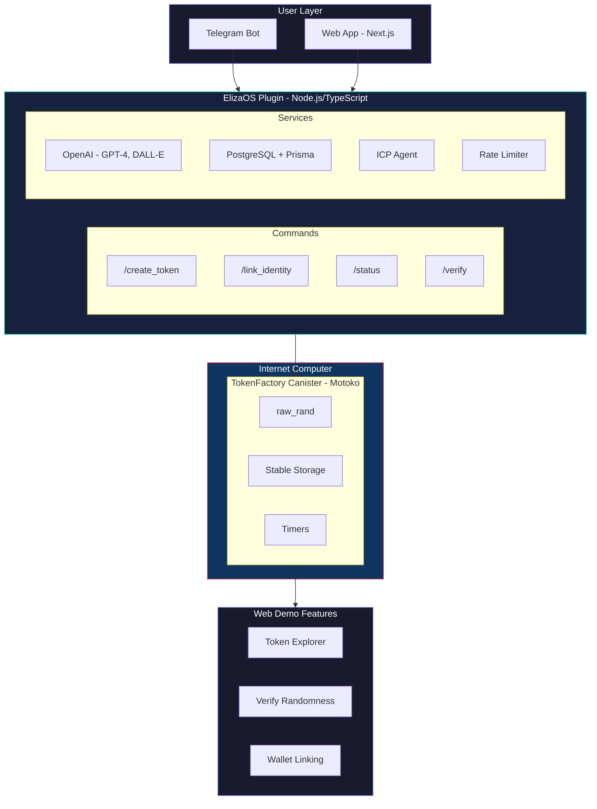
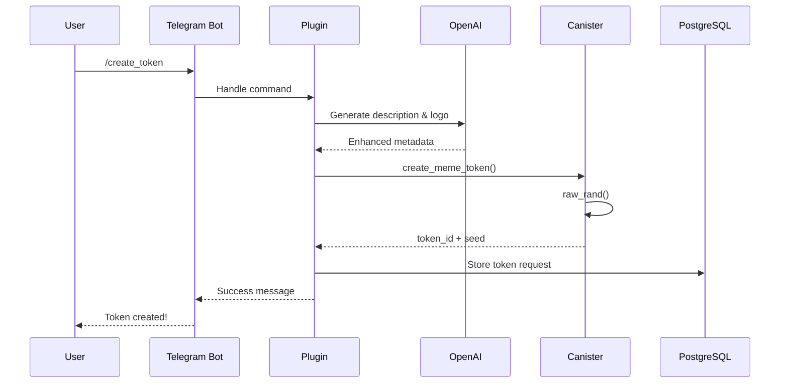

<div align="center">
  
# 🚀 ElizaICP

### AI-Powered Meme Tokens with Provable On-Chain Randomness

[](https://internetcomputer.org)
[](https://elizaos.github.io/eliza/)
[](https://opensource.org/licenses/MIT)

<p align="center">
  
  
</p>

*Create AI-powered meme tokens on the Internet Computer with GPT-4 enhanced descriptions, DALL-E generated logos, and verifiable on-chain randomness.*

</div>

---

## ⚡ Tech Stack

<table>
  <tr>
    <td align="center" width="100">
      <br>
      <sub><b>TypeScript</b></sub>
    </td>
    <td align="center" width="100">
      <br>
      <sub><b>React</b></sub>
    </td>
    <td align="center" width="100">
      <br>
      <sub><b>Next.js</b></sub>
    </td>
    <td align="center" width="100">
      <br>
      <sub><b>Tailwind</b></sub>
    </td>
    <td align="center" width="100">
      <br>
      <sub><b>PostgreSQL</b></sub>
    </td>
  </tr>
  <tr>
    <td align="center" width="100">
      <br>
      <sub><b>Prisma</b></sub>
    </td>
    <td align="center" width="100">
      <br>
      <sub><b>OpenAI</b></sub>
    </td>
    <td align="center" width="100">
      <br>
      <sub><b>Telegram</b></sub>
    </td>
    <td align="center" width="100">
      <br>
      <sub><b>Docker</b></sub>
    </td>
    <td align="center" width="100">
      <br>
      <sub><b>CI/CD</b></sub>
    </td>
  </tr>
</table>

### 🔗 Blockchain

| Technology | Purpose |
|:----------:|:--------|
|  **Internet Computer** | Smart contract platform with threshold cryptography |
| 📜 **Motoko** | Native ICP smart contract language |
| 🎲 **raw_rand** | Cryptographically secure on-chain randomness |

---

## Architecture



### Data Flow



---

## ✨ Features

<table>
  <tr>
    <td>
      <h3>🎲 Provable Randomness</h3>
      <ul>
        <li>ICP's <code>raw_rand</code> generates 32 cryptographic bytes</li>
        <li>Threshold BLS signatures from 2/3 subnet consensus</li>
        <li>Stored immutably on-chain</li>
        <li>Independently verifiable</li>
      </ul>
    </td>
    <td>
      <h3>🤖 AI Integration</h3>
      <ul>
        <li>GPT-4 enhanced token descriptions</li>
        <li>DALL-E 3 generated logos</li>
        <li>Smart content generation</li>
        <li>Rate-limited to prevent abuse</li>
      </ul>
    </td>
  </tr>
  <tr>
    <td>
      <h3>🔐 Production Hardening</h3>
      <ul>
        <li>Stable storage for upgrade safety</li>
        <li>Admin access control</li>
        <li>Structured rate limiting</li>
        <li>Comprehensive security docs</li>
      </ul>
    </td>
    <td>
      <h3>🔗 Wallet Linking</h3>
      <ul>
        <li>Internet Identity integration</li>
        <li>On-chain proof of ownership</li>
        <li>Cryptographically verified</li>
        <li>No private keys shared</li>
      </ul>
    </td>
  </tr>
</table>

---

## 🚀 Quick Start

### Prerequisites

```bash
# Node.js 18+, pnpm, DFX (ICP SDK), PostgreSQL
sh -ci "$(curl -fsSL https://internetcomputer.org/install.sh)"  # Install DFX
npm install -g pnpm
```

### Installation

```bash
# Clone repository
git clone https://github.com/0xSupremeDev/ElizaICP.git
cd eliza-icp

# Install dependencies
cd packages/plugin-icp && pnpm install
cd ../../apps/web && pnpm install
```

### Configuration

```bash
cp packages/plugin-icp/.env.example packages/plugin-icp/.env
cp apps/web/.env.example apps/web/.env.local
# Edit .env files with your API keys
```

### Run Locally

```bash
# Terminal 1: Start ICP replica
dfx start --background

# Terminal 2: Deploy canister
cd packages/plugin-icp/canisters/token_factory && dfx deploy

# Terminal 3: Run bot
cd packages/plugin-icp && pnpm dev

# Terminal 4: Run web app
cd apps/web && pnpm dev
```

---

## 📁 Project Structure

```
eliza-icp/
├── 📦 packages/plugin-icp/      # ElizaOS Plugin
│   ├── src/
│   │   ├── commands/            # Telegram command handlers
│   │   ├── services/            # OpenAI, ICP, PostgreSQL
│   │   └── middleware/          # Rate limiting
│   ├── canisters/               # Motoko smart contracts
│   └── prisma/                  # Database schema
│
├── 🌐 apps/web/                 # Next.js Demo UI
│   ├── app/                     # App Router pages
│   ├── components/              # React components
│   └── lib/                     # Utilities
│
└── 📚 documentation/            # Technical docs
```

---

## 🔧 Environment Variables

### Plugin (`packages/plugin-icp/.env`)

| Variable | Description |
|:---------|:------------|
| `TELEGRAM_BOT_TOKEN` | From [@BotFather](https://t.me/botfather) |
| `OPENAI_API_KEY` | OpenAI API key |
| `POSTGRES_URL` | PostgreSQL connection string |
| `INTERNET_COMPUTER_PRIVATE_KEY` | DFX identity key |
| `TOKEN_FACTORY_CANISTER_ID` | Deployed canister ID |

### Web App (`apps/web/.env.local`)

| Variable | Description |
|:---------|:------------|
| `NEXT_PUBLIC_API_URL` | Backend API URL |
| `NEXT_PUBLIC_CANISTER_ID` | Canister ID |
| `NEXT_PUBLIC_TELEGRAM_URL` | Bot link |

---

## 📖 Documentation

| Document | Description |
|:---------|:------------|
| [🧭 Judge Guide](./documentation/judge-guide.md) | Quick evaluation guide |
| [🏗️ Architecture](./documentation/architecture.md) | Technical design |
| [🎮 Demo Guide](./documentation/demo.md) | Step-by-step walkthrough |
| [🎲 On-Chain Randomness](./documentation/onchain-randomness.md) | `raw_rand` explained |
| [🚀 Deployment](./documentation/deployment.md) | Full deployment guide |
| [🔐 Security](./packages/plugin-icp/SECURITY.md) | Security policy |

---

## 🚀 Deployment

<details>
<summary><b>🌐 ICP Mainnet</b></summary>

```bash
dfx deploy --network ic
```
</details>

<details>
<summary><b>▲ Vercel (Web)</b></summary>

Connect repository, set environment variables, deploy.
</details>

<details>
<summary><b>🐳 Docker (Bot)</b></summary>

```bash
docker build -t eliza-icp-bot .
docker run eliza-icp-bot
```
</details>

---

## 🔒 Security

- ✅ On-chain randomness cannot be manipulated
- ✅ Stable storage preserves state across upgrades
- ✅ Rate limiting prevents abuse
- ✅ Input validation on all endpoints

See [SECURITY.md](./packages/plugin-icp/SECURITY.md) for full policy.

---

## 🤝 Contributing

1. Fork the repository
2. Create feature branch (`git checkout -b feature/amazing-feature`)
3. Commit changes (`git commit -m 'Add amazing feature'`)
4. Push to branch (`git push origin feature/amazing-feature`)
5. Open a Pull Request

---

## 📄 License

This project is licensed under the **MIT License** - see the [LICENSE](LICENSE) file for details.

---

<div align="center">

**Built with ❤️ using Internet Computer and ElizaOS**

[](https://internetcomputer.org/docs)
[](https://elizaos.github.io/eliza/)
[](https://github.com/0xSupremeDev/ElizaICP)

</div>
